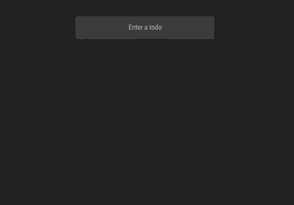

# todo-list

> A simple todo app created using React

##  Installation
> Install npm packages
```
npm install
```

### Clone
- Clone this repo to your local machine using `https://github.com/gurveerdhindsa/todo-list.git`

### Development
```
ng build
npm start
```

##  Support
- Website at <a href="https://gurveerdhindsa.github.io/portfolio/" target="_blank">`gurveerdhindsa.github.io`</a>
